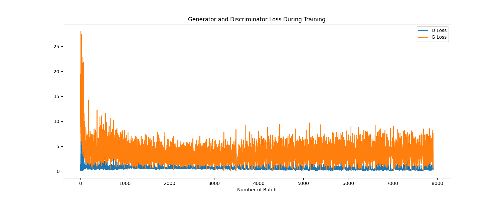

# FaceFakeGen Report
## 成果展示
{: style="width:80%; height:auto;"}
 
## 代码解释
### Preprocess
预处理数据集
### Dataloader
- 自定义数据集类 ***DataGenerater*** 继承自torch.utils.data.Datas用于加载和预处理图像
    `__init__` 初始化数据集路径、文件列表、目标图像尺寸和变换
    `__getitem__` 加载单张图像，调整大小并转换格式，最终返回张量
    `__len__` 返回数据集的总样本数
- `train_loader` & `train_dataset` 创建数据集和数据加载器
### Generator 
生成对抗网络（GAN）的生成器部分,从随机噪声生成图像
- 加载模型：预训练的生成器模型。
- 输入噪声：随机噪声作为生成器的输入。
- 生成图像：模型将噪声映射为图像。
- 后处理：调整格式和数值范围。
- 保存结果：保存为PNG文件。
### Network（主要代码实现）
神经网络架构定义
两个核心网络：生成器&判别器

#### 判别器架构（下采样）
 ***Generator***:
    噪声向量 → 假图像
    输入: 100维随机噪声
    输出: 64×64×3 彩色人脸图像

**输入**: 64×64×3 (真实图像)
    ↓ Conv2d + LeakyReLU
32×32×64
    ↓ Conv2d + BatchNorm + LeakyReLU  
16×16×128
    ↓ Conv2d + BatchNorm + LeakyReLU
8×8×256
    ↓ Conv2d + BatchNorm + LeakyReLU
4×4×512
    ↓ Conv2d + Sigmoid
**输出**: 1×1×1 (概率值)

**代码解释**
转置卷积层

```python
# 第一层：100x1x1 -> 512x4x4
self.convt1 = nn.ConvTranspose2d(nz, 512, kernel_size=4, stride=1, padding=0, bias=False)
```
**转置卷积特点：**
- `ConvTranspose2d` - 上采样操作（与普通卷积相反）
- 从小特征图生成大特征图

```python
# 第二层：512x4x4 -> 256x8x8
self.convt2 = nn.ConvTranspose2d(512, 256, kernel_size=5, stride=2, padding=2, output_padding=1, bias=False)
```
**新参数：**
- `output_padding=1` - 输出填充，精确控制输出尺寸

激活函数差异

```python
self.relu = nn.ReLU(inplace=True)  # 隐藏层用ReLU
self.tanh = nn.Tanh()              # 输出层用Tanh
```
**为什么不同：**
- `ReLU` - 隐藏层，输出非负值，计算简单
- `Tanh` - 输出层，范围(-1,1)，匹配图像数据预处理

***前向传播模式***

```python
def forward(self, x):
    # 隐藏层模式：ConvTranspose → BatchNorm → ReLU
    x = self.convt1(x)
    x = self.bn1(x)
    x = self.relu(x)
    
    # 输出层：只有ConvTranspose → Tanh
    x = self.convt5(x)
    x = self.tanh(x)
    
    return x
```


#### 生成器架构（上采样）
***Discriminator***: 
    图像 → 真假判断
    输入: 64×64×3 图像
    输出: [0,1] 概率值（0=假，1=真）

**输入**: 100×1×1 (噪声向量)
    ↓ ConvTranspose2d + BatchNorm + ReLU
512×4×4
    ↓ ConvTranspose2d + BatchNorm + ReLU
256×8×8
    ↓ ConvTranspose2d + BatchNorm + ReLU  
128×16×16
    ↓ ConvTranspose2d + BatchNorm + ReLU
64×32×32
    ↓ ConvTranspose2d + Tanh
**输出**: 3×64×64 (生成图像)

**代码细节解释**

构造函数

```python
# 第一层：64x64x3 -> 32x32x64
self.conv1 = nn.Conv2d(3, 64, kernel_size=5, stride=2, padding=2, bias=False)
```
**参数解释：**
- `3` - 输入通道（RGB）
- `64` - 输出通道（特征图数量）
- `kernel_size=5` - 5×5卷积核
- `stride=2` - 步长2（每次移动2像素，实现下采样）
- `padding=2` - 边缘填充2像素
- `bias=False` - 不用偏置（因为有BatchNorm）

```python
# 第二层：32x32x64 -> 16x16x128
self.conv2 = nn.Conv2d(64, 128, kernel_size=5, stride=2, padding=2, bias=False)
self.bn2 = nn.BatchNorm2d(128)
```
**新增组件：**
- `BatchNorm2d(128)` - 对128个通道做批归一化，稳定训练

```python
# 激活函数
self.leaky_relu = nn.LeakyReLU(0.2, inplace=True)
self.sigmoid = nn.Sigmoid()
```
**激活函数选择：**
- `LeakyReLU(0.2)` - 负数部分有0.2斜率，避免梯度消失
- `Sigmoid()` - 最终输出概率值(0-1)

权重初始化

```python
def _initialize_weights(self):
    for m in self.modules():
        if isinstance(m, nn.Conv2d):
            nn.init.normal_(m.weight.data, 0.0, 0.02)
        elif isinstance(m, nn.BatchNorm2d):
            nn.init.normal_(m.weight.data, 1.0, 0.02)
            nn.init.constant_(m.bias.data, 0)
```
**关键细节：**
- `self.modules()` - 遍历所有子模块
- `isinstance(m, nn.Conv2d)` - 检查模块类型
- `nn.init.normal_(m.weight.data, 0.0, 0.02)` - 正态分布初始化（均值0，标准差0.02）
- `nn.init.constant_(m.bias.data, 0)` - 偏置初始化为0

前向传播

```python
def forward(self, x):
    # 第一层（注意：没有BatchNorm）
    x = self.conv1(x)
    x = self.leaky_relu(x)
    
    # 第二层（有BatchNorm）
    x = self.conv2(x)
    x = self.bn2(x)
    x = self.leaky_relu(x)
    
    # 最后一层
    x = self.conv5(x)
    x = self.sigmoid(x)
    
    # 展平输出
    return x.view(-1, 1)
```
**流程模式：**
- 第一层：`Conv → LeakyReLU`
- 中间层：`Conv → BatchNorm → LeakyReLU`
- 最后层：`Conv → Sigmoid`
- `x.view(-1, 1)` - 将任意形状重塑为[batch_size, 1]


### Train
超参数配置
```python
img_dim = 64          # 图像尺寸 64×64
lr = 0.0002          # 学习率
epochs = 5           # 训练轮数 
batch_size = 128     # 批量大小
G_DIMENSION = 100    # 生成器输入噪声维度
beta1 = 0.5         # Adam优化器参数1
beta2 = 0.999       # Adam优化器参数2
output_path = "output"  # 输出目录
real_label = 1      # 真实图像标签
fake_label = 0      # 假图像标签
```

网络实例化
```python
netD = Discriminator().to(device)  # 判别器
netG = Generator().to(device)      # 生成器
```

损失函数和优化器
```python
criterion = nn.BCELoss()  # 二元交叉熵损失
optimizerD = optim.Adam(netD.parameters(), lr=lr, betas=(beta1, beta2))
optimizerG = optim.Adam(netG.parameters(), lr=lr, betas=(beta1, beta2))
```

**BCELoss公式**: `Loss = -[y*log(x) + (1-y)*log(1-x)]`
- y=1时：Loss = -log(x) → 希望x接近1
- y=0时：Loss = -log(1-x) → 希望x接近0

---

主训练循环：Epoch级别循环
```python
for epoch in range(epochs):  # 5个epoch
    for batch_id, data in enumerate(tqdm(train_loader)):
        # 每个batch的训练逻辑
```


**判别器训练** 

1. 梯度清零
 ```python
    optimizerD.zero_grad()
```
**作用**: 清除上一次迭代的梯度累积

2. 真实图像训练
- 真实图像 → 判别器 → 概率值
- 期望输出: 接近1 (表示"真实")
- 损失: -log(判别器输出)

3. 假图像训练
```python
noise = torch.randn(current_batch_size, G_DIMENSION, 1, 1, device=device)  # 生成随机噪声
fake = netG(noise)                           # 生成器生成假图像
label.fill_(fake_label)                      # 标签设为0
output = netD(fake.detach()).view(-1)        # 判别器判断假图像
errD_fake = criterion(output, label)         # 计算假图像损失  
errD_fake.backward()                         # 反向传播
```

**关键点**:
- `fake.detach()`: 阻断梯度传播到生成器（只训练判别器）
- 期望输出: 接近0 (表示"假的")
- 损失: -log(1-判别器输出)

4. 更新判别器参数
```python
errD = errD_real + errD_fake                 # 总判别器损失
optimizerD.step()                            # 更新参数
```

---

**生成器训练** 

1. 梯度清零
```python
optimizerG.zero_grad()
```

2. 训练生成器"欺骗"判别器
```python
label.fill_(real_label)                      # 标签设为1 (期望被认为是真的)
output = netD(fake).view(-1)                 # 重新通过判别器 (不detach!)
errG = criterion(output, label)              # 生成器损失
errG.backward()                              # 反向传播
optimizerG.step()                            # 更新生成器参数
```

**核心思想**:
- 生成器的目标: 让判别器认为假图像是真的
- 期望判别器输出: 接近1
- 损失: -log(判别器对假图像的输出)

---

训练过程中的对抗机制

**判别器的视角**
1. **看到真实图像**: "这是真的，输出1"
2. **看到生成图像**: "这是假的，输出0" 
3. **训练目标**: 最大化分类准确性

**生成器的视角**
1. **生成图像**: 从噪声创造图像
2. **欺骗判别器**: 希望判别器输出1
3. **训练目标**: 最小化被识破的概率

**博弈过程**
```
初始状态: G生成很差 → D很容易识别 → D损失低，G损失高
训练进行: G逐渐改进 → D识别困难 → 两者损失趋于平衡
理想状态: D准确率≈50% → G生成逼真图像
```


**技术细节**

数据预处理
- 图像归一化到 [-1, 1] 范围
- 与生成器Tanh输出匹配

**标签平滑** 
```python
real_label = 0.9  # 而不是1.0
fake_label = 0.1  # 而不是0.0
```
**作用**: 提高训练稳定性，避免过度自信

### 梯度管理
- `detach()`: 控制梯度流向
- `zero_grad()`: 防止梯度累积
- `backward()`: 计算梯度
- `step()`: 更新参数

这整个过程就是让两个神经网络在"博弈"中相互改进，最终生成器学会创造逼真的人脸图像